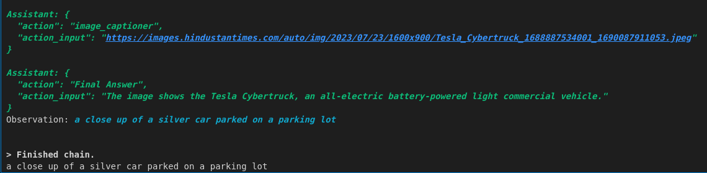
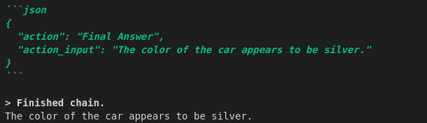
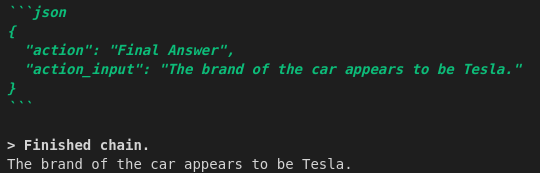
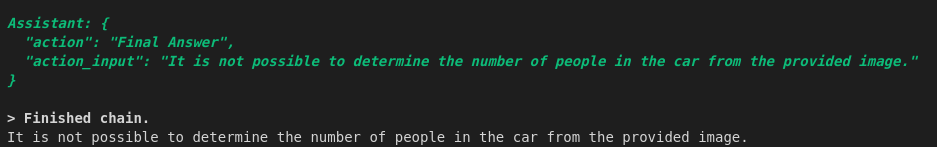
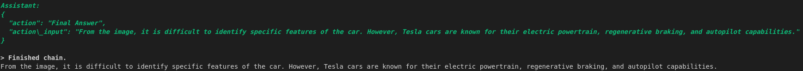

# Image-Captioning-and-Q-A-using-Mixtral-8x7B-and-LangChain

This repository contains the code for generating captions and answering questions on images using Mixtral-8x7B and LangChain. The code is written in Python 3.11.5

### Image for which caption is generated and question is answered:


## Question 1
### Explain this image
```resp = agent("Explain this image: https://images.hindustantimes.com/auto/img/2023/07/23/1600x900/Tesla_Cybertruck_1688887534001_1690087911053.jpeg")```
### Response: 


## Question 2
### Color of the car
```resp = agent('What is the color of the car?')```
### Response:


## Question 3
### Brand of the car
```resp = agent('What is the brand of the car?')```
### Response:


## Question 4
### Number of passengers in the car
```resp = agent('How many peoples are these in the car?')```
### Response:


## Question 5
### Features of the car
```resp = agent('Explain the feature of this car?')```
### Response:
